# Middleware Architecture

ROAM middleware is the integration layer that lets products apply shared runtime context, identity-aware execution, and policy decisions close to the point where work actually happens.

## Runtime Flow At The Boundary

At a high level, ROAM middleware does three things for every participating request:

1. establish who or what is acting
2. attach the runtime context needed to make a safe decision
3. pass only validated execution downstream

The diagram below shows the logical shape of that flow.

### Request Flow Diagram

This diagram shows the abstract pipeline a request moves through before execution continues.

```mermaid
sequenceDiagram
    participant Client as Client Application
    participant API as Product API / Service Boundary
    box "ROAM Middleware Layer" #f9f9f9
        participant Identity as Identity Context
        participant Runtime as Runtime Interceptor
        participant Policy as Policy Review
    end
    participant Data as Downstream Service / Data Layer

    Note over Client, API: Request enters a ROAM-enabled boundary
    Client->>API: 1. Submit request
    
    rect rgb(35, 35, 35)
        Note over API, Identity: Layer 1: Identity and request context
        API->>Identity: 2. Resolve identity and context
        Identity->>Identity: Match trusted identity inputs
        alt Identity Invalid
            Identity-->>API: 401 Unauthorized
            API-->>Client: Authentication error
        else Identity Valid
            Identity->>Runtime: 3. Attach runtime context
        end
    end

    rect rgb(40, 35, 35)
        Note over Runtime, Policy: Layer 2: Validation and policy review
        Runtime->>Runtime: Interpret request intent
        Runtime->>Policy: 4. Evaluate request
        Policy->>Policy: Apply execution rules
        
        alt Request Rejected
            Policy-->>Runtime: Block execution
            Runtime-->>API: 403 Forbidden
            API-->>Client: Request rejected
        else Request Approved
            Policy-->>Runtime: 5. Continue
        end
    end

    rect rgb(35, 40, 35)
        Note over Runtime, Data: Layer 3: Downstream execution
        Runtime->>Data: 6. Execute downstream work
        Data-->>Runtime: 7. Return result
    end

    Runtime-->>API: 8. Format response
    API-->>Client: 9. Final result
```

### What This Layer Adds

1. **Identity-aware context** so requests carry the organization, user, or tool information needed for safe execution.
2. **Interception at the right boundary** so ROAM can enrich or validate intent before it reaches core business logic.
3. **Policy-aware execution** so only approved operations continue into downstream systems.
4. **Minimal disruption to existing systems** so teams can integrate ROAM without redesigning their application architecture.

## Integration Models

ROAM is designed to be protocol-agnostic and to sit as close as possible to the moment where intent becomes execution.

### Model 1: Embedded Request Integration

This model fits products that already have an API layer and want ROAM to participate in request handling without changing the rest of the application stack.

Common fit:

- existing APIs and service boundaries
- application teams adding runtime context and policy checks
- products that want ROAM close to synchronous request handling

```mermaid
sequenceDiagram
    participant User as End User (UI)
    participant API as Product API
    participant OAM as ROAM Middleware
    participant Runtime as ROAM Runtime
    participant DB as Data Layer

    Note over User: 1. User action begins in the product
    User->>API: 2. API Request
    
    rect rgb(35, 35, 35)
        Note over API, OAM: Embedded request boundary
        API->>OAM: Intercept and enrich request
        OAM->>OAM: Resolve identity and runtime context
        
        par Runtime Coordination
            OAM--)Runtime: Emit runtime event
        and Request Validation
            OAM->>OAM: Evaluate request policy
        end
        
        alt Valid
            OAM->>API: Continue request
            API->>DB: Execute application work
            DB-->>API: Result
            API-->>User: Response
        else Rejected
            OAM-->>User: 403 Rejected Request
        end
    end
```

### Model 2: Proxy Or Sidecar Boundary

This model fits systems that do not expose a clean application middleware layer but still need a controlled integration boundary.

Common fit:

- legacy applications
- direct data-access clients
- environments that need interception outside the primary application codebase

```mermaid
sequenceDiagram
    participant User as Existing Application
    participant Proxy as ROAM Proxy / Sidecar
    participant Runtime as ROAM Runtime
    participant DB as Data Layer
    participant Identity as Identity Source

    Note over User: 1. Existing system issues a request
    User->>Proxy: 2. Forward request to boundary layer
    
    rect rgb(40, 35, 35)
        Note over Proxy: Boundary interception
        Proxy->>Identity: Resolve permissions and context
        Proxy--)Runtime: Emit runtime event
        Proxy->>Proxy: Evaluate request rules
        
        alt Approved
            Proxy->>DB: Execute downstream request
            DB-->>Proxy: Rows
            Proxy-->>User: Result
        else Blocked
            Proxy-->>User: Rejected Request
        end
    end
```

### Model 3: Hybrid Runtime Placement

This model fits teams that need local execution boundaries but still want shared governance, visibility, or centralized coordination patterns.

Common fit:

- high-compliance deployments
- organizations with mixed hosted and self-managed infrastructure
- teams that need execution inside their own perimeter

### Model 4: Fully Self-Hosted Runtime

This model fits teams that want full control of runtime placement and operational ownership.

Common fit:

- air-gapped or highly restricted environments
- self-managed platform teams
- development and experimentation workflows built entirely on the public stack

## Choosing The Right Boundary

Pick the model that keeps ROAM closest to the boundary where your system already makes trust and execution decisions. For most teams, that means starting with an SDK or embedded middleware pattern and expanding only when deployment constraints require it.
