# Middleware Architecture

## OAM & BYOI Integration Process Flow (Conceptual)

This section illustrates the **logical internals** of the OAM middleware stack. Regardless of the deployment model (Cloud, Hybrid, or On-Prem), the data flow follows these three distinct phases of interception and validation.

### Logical Data Flow Diagram

The following diagram represents the abstract pipeline that every request passes through, showing how Identity (BYOI) and Security (Policy Engine) layers are composed. For specific infrastructure layouts, see the [Deployment & Integration Models](#deployment--integration-models) section below.

```mermaid
sequenceDiagram
    participant Agent as LLM Agent / Client
    participant API as Existing API / Gateway
    box "OAM Middleware Stack" #f9f9f9
        participant BYOI as BYOI Auth Layer
        participant Interceptor as OAM Interceptor
        participant Policy as Policy Engine (P2SQL)
    end
    participant ORM as Existing ORM / DB

    Note over Agent, API: Request Phase
    Agent->>API: 1. Submit Request via OAM SDK (gRPC/HTTP)
    
    rect rgb(35, 35, 35)
        Note over API, BYOI: Layer 1: Identity Verification
        API->>BYOI: 2. Validate Token & Identity
        BYOI->>BYOI: Check against Mirrored IdP Data (SYNC)
        alt Identity Invalid
            BYOI-->>API: 401 Unauthorized
            API-->>Agent: Auth Error
        else Identity Valid
            BYOI->>Interceptor: 3. Identity Context (Attached)
        end
    end

    rect rgb(40, 35, 35)
        Note over Interceptor, Policy: Layer 2: Intent & Security
        Interceptor->>Interceptor: Decode Tool Call / Query
        Interceptor->>Policy: 4. Submit for Inspection
        Policy->>Policy: Analyze Semantics (P2SQL)
        
        alt Policy Violation (e.g., Injection, Unauthorized DDL)
            Policy-->>Interceptor: Block Execution
            Interceptor-->>API: 403 Forbidden (Policy)
            API-->>Agent: Security Violation
        else Policy Valid
            Policy-->>Interceptor: 5. Intent Approved
        end
    end

    rect rgb(35, 40, 35)
        Note over Interceptor, ORM: Layer 3: Execution
        Interceptor->>ORM: 6. Execute Deterministic Query
        ORM-->>Interceptor: 7. Return Data
    end

    Interceptor-->>API: 8. Formatted Response
    API-->>Agent: 9. Final Result
```

### Key Components

1.  **BYOI Auth Layer**: Acts as the first line of defense, verifying the request's identity against the locally mirrored Identity Provider (IdP) data (synced via `roam-sync`). It attaches the user's RBAC context to the request.
2.  **OAM Interceptor**: Intercepts the request (which may be a raw prompt or a structured tool call). It handles the translation between the agent's intent and the system's execution capabilities.
3.  **Policy Engine**: Inspects the intercepted intent using the P2SQL (Prompt-to-SQL) logic. It ensures that even valid identities cannot execute harmful or unauthorized commands (e.g., preventing command chaining or checking row-level security).
4.  **Existing ORM/DB**: The target system logic remains largely untouched, receiving only pre-validated, secure queries from the OAM middleware.

## Deployment & Integration Models

OAM is designed to be protocol-agnostic, sitting as close to the intent execution as possible. The following models outline the primary deployment strategies supported by Roam.

### Model 1: Managed Middleware (Active Interception)

*   **Architecture**: Cloud-Hosted Orchestration + Application-Embedded Middleware.
*   **Target**: Enterprise Apps with existing API & ORM.
*   **Identity**: Synced to OAM Cloud (BYOI).
*   **Agent Infrastructure**: Managed by OAM Cloud.

In this model, the **OAM Middleware** is added directly to the Application's API stack (e.g., as a Rocket Fairing, Express Middleware, or Filter). The User interacts with the Application UI normally. The Middleware intercepts requests, validates identity via BYOI, and asynchronously notifies the Agent (Shadow Mode) while enforcing P2SQL safety policies on the synchronous request.

```mermaid
sequenceDiagram
    participant User as End User (UI)
    participant API as Enterprise API
    participant OAM as OAM Middleware
    participant Cloud as OAM Cloud (Agent)
    participant DB as SQL Database

    Note over User: 1. User Initiates Action
    User->>API: 2. API Request
    
    rect rgb(35, 35, 35)
        Note over API, OAM: Embedded Middleware
        API->>OAM: Intercept & Extract Identity
        OAM->>OAM: BYOI Validation
        
        par Async Agent Handling
            OAM--)Cloud: Notify Agent (Shadow Event)
        and Synchronous Policy Check
            OAM->>OAM: P2SQL Safety Check
        end
        
        alt Valid
            OAM->>API: Pass Verified Request
            API->>DB: Execute ORM Transaction
            DB-->>API: Result
            API-->>User: Response
        else Blocked by Policy
            OAM-->>User: 403 Policy Violation
        end
    end
```

### Model 2: Managed Proxy (Direct SQL Integration)

*   **Architecture**: Cloud-Hosted Orchestration + OAM Proxy/Sidecar.
*   **Target**: Legacy/Fat Client Apps with Direct SQL/LDAP access.
*   **Identity**: Synced to OAM Cloud (BYOI).
*   **Agent Infrastructure**: Managed by OAM Cloud.

For applications connecting directly to a database without an API layer, OAM acts as a **Smart Proxy**. The Legacy Application connects to the Proxy instead of the Database. The Proxy validates the identity and SQL intent before forwarding the query.

```mermaid
sequenceDiagram
    participant User as Legacy App (User)
    participant Proxy as OAM Proxy (On-Prem)
    participant Cloud as OAM Cloud (Agent)
    participant DB as SQL Database
    participant LDAP as Enterprise LDAP

    Note over User: 1. User Executes Query
    User->>Proxy: 2. Raw SQL / LDAP Request
    
    rect rgb(40, 35, 35)
        Note over Proxy: Proxy Interception
        Proxy->>LDAP: Verify User Permissions
        Proxy--)Cloud: Async Event (Shadow)
        Proxy->>Proxy: P2SQL Analysis
        
        alt Valid
            Proxy->>DB: Execute SQL
            DB-->>Proxy: Rows
            Proxy-->>User: Result Set
        else Blocked
            Proxy-->>User: Security Exception
        end
    end
```

### Model 3: Hybrid Self-Hosted

*   **Architecture**: Self-Hosted Agent/gRPC + Cloud Identity/Governance.
*   **Target**: High-compliance environments requiring on-prem execution.
*   **Identity**: Synced to OAM Cloud (for central audit/billing).
*   **Agent Infrastructure**: Self-hosted (Docker/Kubernetes).

The Agent infrastructure runs entirely within the customer's perimeter, but relies on OAM Cloud for global identity synchronization, audit logging, and billing (AAU tracking).

### Model 4 & 5: Pure Open Core / Fully Self-Hosted

*   **Architecture**: Fully Air-Gapped / Self-Managed.
*   **Target**: Developers, highly secure enclaves, or open-source users.
*   **Identity**: Managed locally (no cloud sync).
*   **Agent Infrastructure**: Self-hosted.

This model serves the Open Core community or air-gapped enterprise needs. The entire stack (Agent, OAM Middleware, Policy Engine, Identity) runs locally. No data leaves the perimeter.

```mermaid
sequenceDiagram
    participant Source as Kafka / Desktop App
    participant OAM as Local OAM (Self-Hosted)
    participant Logic as Business Logic
    participant DB as System of Record

    Source->>OAM: Event / RPC Call
    
    rect rgb(35, 35, 45)
        Note over OAM: Local Execution
        OAM->>OAM: Local Policy Check
        OAM->>Logic: Invoke Handler
    end

    Logic->>DB: Update State
    DB-->>Logic: Success
    Logic-->>OAM: Confirmation
    OAM-->>Source: Result
```

